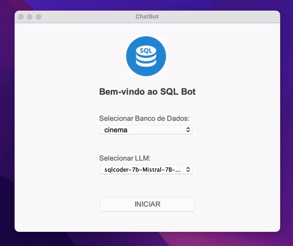
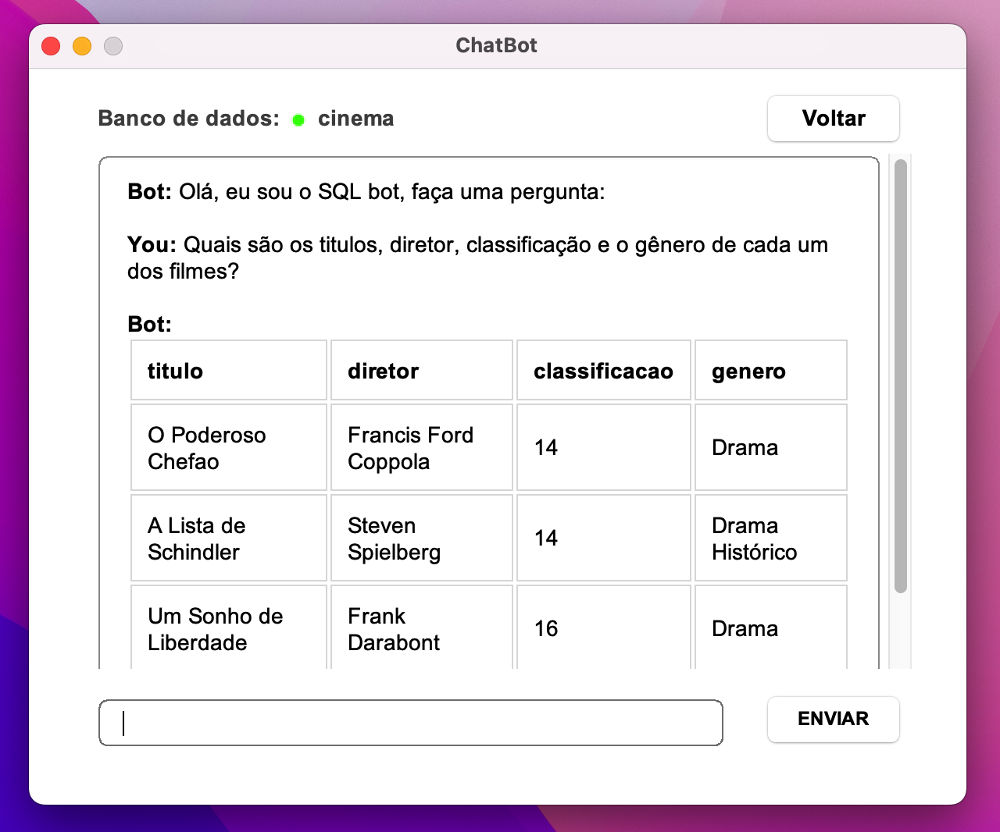
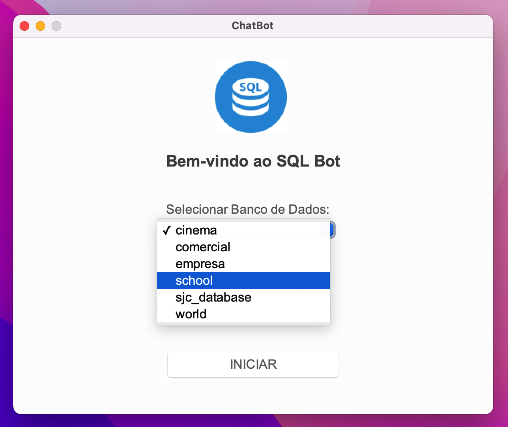
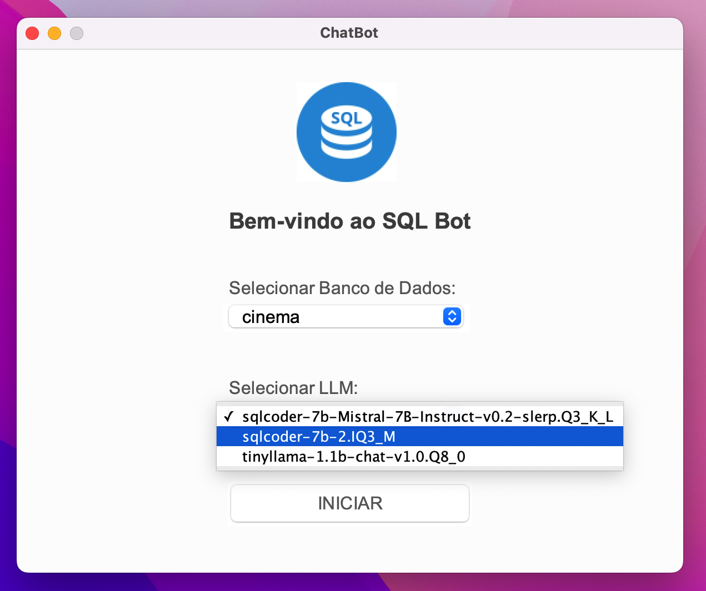
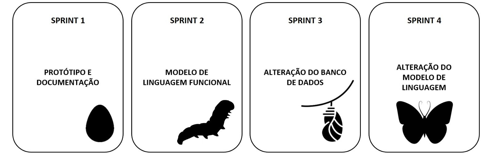

# SQL Chat Bot

O projeto visa criar uma aplicação que permite acessar informações de um banco de dados MySQL usando exclusivamente a linguagem natural. A aplicação deve ser capaz de interpretar a linguagem natural e traduzi-la para uma consulta SQL, executando-a e retornando o resultado ao usuário.

### Requisitos Funcionais
<ul>
<li>RF1 - Permitir ao usuário selecionar um banco de dados</li>
<li>RF2 - Criação de uma tela para receber uma consulta escrita em linguagem natural</li>
<li>RF3 - Conversão da linguagem natural em código SQL</li>
<li>RF4 - Execução do comando SQL gerado no banco de dados</li>
<li>RF5 - Exibição dos resultados</li>
</ul>

### Requisitos Não Funcionais
<ul>
<li>RNF1 - Manual do Usuário (GitHub)</li>
<li>RNF2 - Guia de instalação (GitHub)</li>
<li>RNF3 - Usabilidade</li>
</ul>

### Características
<ul>
<li>Interface Gráfica projetada para proporcionar uma experiência de usuário intuitiva, facilitando a utilização das funcionalidades disponíveis.</li>
<li>Compatibilidade com LLM SQLCoder: o software demonstra um excelente desempenho ao trabalhar em conjunto com uma variedade de modelos de linguagem SQLCoder.</li>
<li>Os usuários conseguem selecionar e integrar facilmente qualquer banco de dados disponível em suas máquinas.</li>
<li>O software possui a capacidade de alterar para qualquer modelo de linguagem instalado no computador.</li>
<li>Testes realizados em Português (BR) e Inglês (EUA)</li>
</ul>

## Demonstração
Demonstração do funcionamento geral do SQL Bot:

### Chat Funcional (Sprint 2)
Na Sprint 2, o chat passou a ser funcional para pesquisas, permitindo que o sistema receba perguntas em linguagem natural e retorne respostas em formato de tabela, contendo todos os dados relevantes.

### Alteração do Banco de Dados (Sprint 3)

Na Sprint 3, foi incluída a função de modificação do banco de dados, permitindo a realização de consultas em qualquer banco de dados que o usuário possua.

### Alteração do Modelo de Linguagem (Sprint 4)

Na Sprint 4, foi adicionada a função de alterar qualquer modelo de linguagem que o usuário possua, proporcionando uma personalização avançada.

<h1>Backlogs</h1>

<h2>Sprint 2</h2>

| Rank | Prioridade | User Story | Estimativa | Sprint | Requisito do Parceiro | Critério de aceitação |
|------|------------|------------|------------|--------|-----------------------|------------------------|
| 1   | ALTA       | Eu, como usuário, quero usar uma interface do usuário finalizada para ter uma experiência consistente e intuitiva ao navegar e interagir com o sistema. | 5 | 2 | RF2 | A interface do usuário deve estar finalizada e proporcionar uma experiência consistente e intuitiva. |
| 2   | ALTA       | Eu, como usuário, quero inserir perguntas na interface do sistema em linguagem natural para facilitar a interação | 3 | 2 | RF2 | A interface deve permitir a inserção de perguntas em linguagem natural de forma clara e precisa. |
| 3   | ALTA       | Eu, como desenvolvedor, quero converter perguntas em linguagem natural para consultas SQL para executar no banco de dados | 13 | 2 | RF3 | O sistema deve converter perguntas em linguagem natural em consultas SQL corretas e eficientes. |
| 4  | ALTA       | Eu, como desenvolvedor, quero executar comandos SQL no banco de dados para obter resultados relevantes para o usuário | 8 | 2 | RF4 | O sistema deve ser capaz de executar comandos SQL no banco de dados de forma segura e eficiente. |
| 5  | ALTA       | Eu, como usuário, quero ver os resultados das consultas exibidos na tela para tomar decisões com base neles | 7 | 2 | RF5 | Os resultados das consultas devem ser exibidos de forma clara e organizada na tela. |

<h2>Sprint 3</h2>

| Rank | Prioridade | User Story | Estimativa | Sprint | Requisito do Parceiro | Critério de aceitação |
|------|------------|------------|------------|--------|-----------------------|------------------------|
| 6  | MÉDIA      | Eu, como usuário, quero ter a capacidade de alterar o banco de dados que está sendo consultado para explorar diferentes conjuntos de dados | 10 | 3 | RF1 | O sistema deve permitir que o usuário alterne entre diferentes bancos de dados de forma fácil e intuitiva. |
| 7 | BAIXA      | Eu, como usuário, quero que a interface do sistema seja melhorada para tornar a interação mais intuitiva e agradável | 5 | 3 | RF2 | As melhorias na interface do sistema devem resultar em uma interação mais intuitiva e agradável para o usuário. |

<h2>Sprint 4</h2>

| Rank | Prioridade | User Story | Estimativa | Sprint | Requisito do Parceiro | Critério de aceitação |
|------|------------|------------|------------|--------|-----------------------|------------------------|
| 8 | MÉDIA      | Eu, como usuário, quero poder selecionar o modelo de linguagem que está sendo usado para fazer as consultas para personalizar a experiência | 10 | 4 | RF3 | O sistema deve permitir que o usuário selecione entre diferentes modelos de linguagem para realizar consultas de acordo com suas preferências. |
| 9  | BAIXA      | Eu, como usuário, quero poder ler o manual do aplicativo para entender suas funcionalidades e como usá-lo | 5 | 4 | RNF1 | O manual do aplicativo deve estar disponível de forma clara e acessível para o usuário. |
| 10  | BAIXA      | Eu, como usuário, quero poder ler o guia de instalação para o funcionamento do aplicativo para garantir uma instalação correta | 4 | 4 | RNF2 | O guia de instalação deve fornecer instruções claras e precisas para uma instalação correta do aplicativo. |

## MVP

## Tecnologias

    &nbsp;Java - Linguagem de programação
 

 

   &nbsp;Figma - Prototipagem
 

    &nbsp;GitHub - Versionamento
 

   
   &nbsp; IntelliJ - IDEA
 

   
   &nbsp;MySQL - Banco de dados
 

 

   
   &nbsp;LangChain4j - Biblioteca Java
 

   
   &nbsp;Ollama - Executor de modelos de linguagem
 

 

   
   &nbsp; LM Studio - Executor de modelos de linguagem
 

## Equipe

Somos alunos do 2° semestre do curso de Análise e Desenvolvimento de Sistemas da instituição de ensino Fatec Prof° Jessen Vidal de São José dos Campos.

|    Função     |             Nome             |                                                                           GitHub                                                                            |                                                                                                                              LinkedIn                                                                                                                               |
|:-------------:|:----------------------------:|:-----------------------------------------------------------------------------------------------------------------------------------------------------------:|:-------------------------------------------------------------------------------------------------------------------------------------------------------------------------------------------------------------------------------------------------------------------:|
| Product Owner |    Daniel Sendreti Broder    |        |                                                                                                     |
| Scrum Master  |  Guilherme Cleyton Pereira   |          |                                                                              |
|   Dev Team    |    Gabriel Carvalho Silva    |  |                                                                                       |
|   Dev Team    | Gabriel Vasconcelos Ferreira |    |  |
|   Dev Team    |     Paloma Lima da Silva     |    |                                                                                            |
|   Dev Team    |    Victor Herculano Godoy    |    |                                                                                                     |

[Voltar ao topo](#topo)

 
